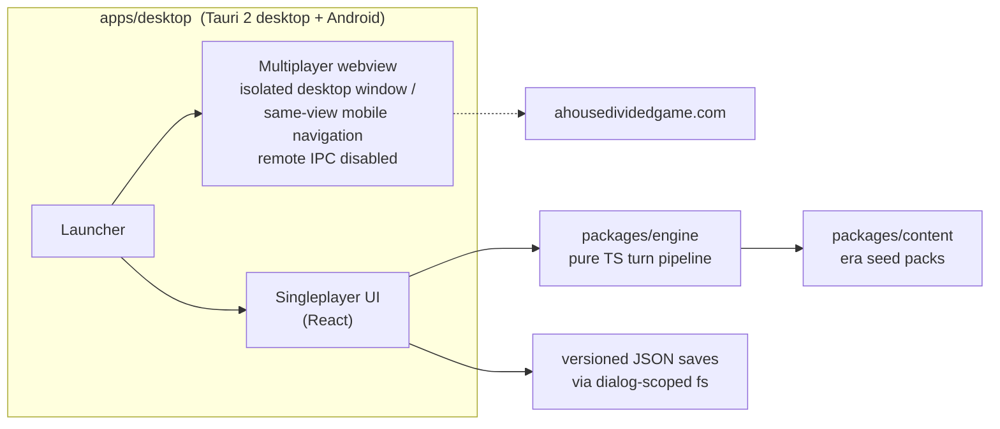

<p align="center">
  
</p>

<h1 align="center">AHDClient</h1>

<p align="center">
  The native desktop and Android client for A House Divided.
</p>

<p align="center">
  <a href="https://github.com/Egg3901/AHDClient/actions/workflows/verify.yml"></a>
  
  
  
</p>

<p align="center">
  
  
  
  
</p>

---

## Overview

AHDClient is the multiplatform client for [A House Divided](https://ahousedividedgame.com): one native app with a live multiplayer entry and a fully local singleplayer sandbox. Desktop builds keep multiplayer in a hardened second webview. Android uses its single app webview for multiplayer so the existing OAuth and cookie-backed session flow stays in-app; Tauri remote API access remains disabled. Boot a local world in any era, as any playable country, advance turns at your own pace, save, and replay a seed.

Singleplayer runs no server. The simulation is a library inside the app process: no listeners, no network, no accounts. Turns cost the player's CPU and nothing else.

## Download

The first official build is available from [GitHub Releases](https://github.com/Egg3901/AHDClient/releases/latest). Windows uses an x64 NSIS installer. Android, Linux, and macOS packages are published alongside it. Release binaries are currently unsigned, so Windows SmartScreen and macOS Gatekeeper may require explicit approval from the player.

## Architecture



| Module | Role |
|---|---|
| `packages/engine` | Deterministic simulation core. No Tauri, no DOM, no IO. Runs headless. |
| `packages/content` | Era seed packs: versioned world templates the engine boots from. |
| `apps/desktop` | Tauri Rust shell plus React webview for desktop and Android. Owns windows, dialogs, file IO, and mode routing. |

Design rules, in order of importance:

1. **One world document.** The entire game state is a single serializable `WorldState`. Saves are versioned JSON envelopes with forward migrations at load.
2. **Determinism.** All randomness flows through a seeded RNG stored in the world. Same seed + same actions = same world, across save/load and across machines. Tests enforce this.
3. **Phases are the porting unit.** Mainline runs ~60 ordered turn phases; each system arrives here as a pure phase over `WorldState`, preserving mainline's relative ordering.
4. **The engine never imports the platform.** Headless forever: tests, balance sims, a future CLI.

The full integration contract, module boundaries, and the binding security doctrine live in [docs/FRAMEWORK.md](docs/FRAMEWORK.md). Active parallel work streams are briefed in [docs/briefs/](docs/briefs/).

## Development

Requires Node >= 22.12 and Rust (plus `libwebkit2gtk-4.1-dev` on Linux).

```
npm install
npm run release:check # synchronized version and changelog metadata
npm run verify       # typecheck + bounded fast tests: the merge gate
npm run verify:full  # opt-in exhaustive multi-turn simulation suite
npm run dev      # tauri dev
```

Desktop changes additionally require `npm run build:web --workspace apps/desktop` and `cargo check` in `apps/desktop/src-tauri`.

## Relationship to mainline

Mainline A House Divided is a live multiplayer service. AHDClient consumes it in online mode and diverges deliberately in singleplayer: on-demand turns (one turn = one in-game week), local saves, and no anti-abuse systems. Both codebases are proprietary Lakeside Games products. Simulation logic and seed content move between them under the owner's authority. Era seed packs are designed to become a shared format: new eras get built and playtested here before mainline resets into them.

## License

[Proprietary source-available terms](LICENSE.md). Copyright Lakeside Games. All rights reserved. The source may be inspected and evaluated, but reuse, modification, redistribution, and commercial operation require prior written permission.
