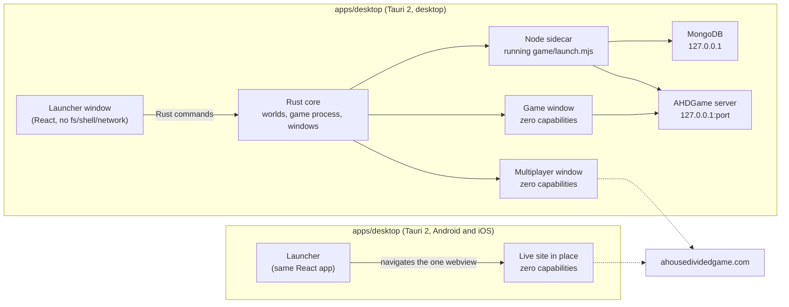

<p align="center">
  
</p>

<h1 align="center">AHDClient</h1>

<p align="center">
  The desktop and mobile client for A House Divided: the real game, on your own machine.
</p>

<p align="center">
  <a href="https://github.com/Egg3901/AHDClient/actions/workflows/verify.yml"></a>
  
  
</p>

<p align="center">
  
  
  
  
  
</p>

---

## Overview

AHDClient is the native client for [A House Divided](https://ahousedividedgame.com). On desktop it opens the live multiplayer game in a hardened window, and it runs the whole game locally for singleplayer: the same server, the same screens, the same maps and mechanics, with one local account and turns that advance when you press End turn.

Singleplayer is not a port. The client ships the game's own server build and a Node runtime, finds or downloads MongoDB once, and runs both on loopback. A world is a folder in your app data; you can keep several and switch between them from the launcher.

On Android and iOS the same launcher, settings and account linking ship without the local game: Multiplayer and Sandbox open the live site inside the app, where your session stays. Singleplayer and Worldsim need a desktop operating system.

## Multiplayer briefing

Open **Briefing** from the launcher to check Profile, Election and Corporation
stats. Swipe between cards, use the tabs, or use the arrow keys. Your selected
card is remembered. **Open profile**, **Open election** and **Open corporation**
take you to the corresponding game page.

On desktop, **Picture-in-picture** opens the briefing in a small window that
stays above other apps. Toggle **Pinned** to let other windows cover it. The
game toolbar also has a **PiP** button. This briefing always shows Multiplayer.

On Android, add AHD Profile, AHD Election or AHD Corporation from the Home
Screen widget picker. Each widget has previous/next and refresh controls.
Long-press the app icon for Profile, My election and My corporation shortcuts.

On iOS, add the same three widgets from the widget gallery. Stack widgets of
the same size to swipe between them using the system widget stack. Tap a widget
to open its game page. Sign in to Multiplayer in the app first.

The app refreshes visible cards every minute and on resume or reconnect. Home
Screen widgets request updates every 30 minutes; the OS decides when those
requests run. All cards show their update time, and saved stats expire after
24 hours. Widgets do not continuously stream live data.

## Download

Builds are published on [GitHub Releases](https://github.com/Egg3901/AHDClient/releases/latest): a Windows x64 installer, macOS disk images for Apple silicon and Intel, and Linux AppImage and Debian packages. Release binaries are unsigned, so Windows SmartScreen and macOS Gatekeeper may ask for explicit approval. Android ships as an APK for sideloading and a Play bundle; iOS builds are prepared for the App Store and TestFlight.

The first world you create downloads the MongoDB server (about 30 MB on Windows, 90 to 100 MB elsewhere). Everything after that is offline, including art the game has shown you once.

## Architecture



| Piece | Role |
|---|---|
| `apps/desktop/src-tauri` | Rust: world folders, the game process and its readiness, the loopback HTTP proxy, the game and online windows (`desktop.rs`); the single-webview navigation policy and account watch on phones (`mobile.rs`); the online origin allowlist and account linking shared by both (`lib.rs`). |
| `apps/desktop/src-tauri/gen/android` | The committed Android Studio project: user agent marker, system bar insets, release signing. |
| `apps/desktop/src` | The launcher: eras, worlds, boot progress, the running-world screen, multiplayer entry. |
| `scripts/prepare-game.mjs` | Stages the Node sidecar and the AHDGame singleplayer build into the Tauri bundle. Nothing it produces is committed. |

The binding contract with the game repository and the security doctrine live in [docs/FRAMEWORK.md](docs/FRAMEWORK.md).

## Development

Requires Node 22 and Rust (plus `libwebkit2gtk-4.1-dev` on Linux), and an [AHDGame](https://github.com/Egg3901/AHDGame) checkout for the game itself.

```
npm install
node scripts/prepare-game.mjs --game-dir ../AHDGame   # Node sidecar + game build
npm run release:check   # synchronized version and changelog metadata
npm run verify          # typecheck + tests: the merge gate
npm run dev             # tauri dev
```

Rust changes additionally need `cargo test` in `apps/desktop/src-tauri`; `node scripts/prepare-game.mjs --node-only` is enough for that. Mobile builds are described in [docs/RELEASING.md](docs/RELEASING.md): `npx tauri android build` with the Android SDK and NDK, and `npx tauri ios build` on a Mac.

## Relationship to mainline

Mainline A House Divided is a live multiplayer service. AHDClient consumes it in online mode and runs it unchanged in singleplayer mode. Singleplayer behaviour that differs from multiplayer (on-demand turns, no anti-abuse scans, no telemetry) is implemented in the game repository behind its own singleplayer guard, not here. Both codebases are proprietary Lakeside Games products.

## License

[Proprietary source-available terms](LICENSE.md). Copyright Lakeside Games. All rights reserved. The source may be inspected and evaluated, but reuse, modification, redistribution, and commercial operation require prior written permission.
