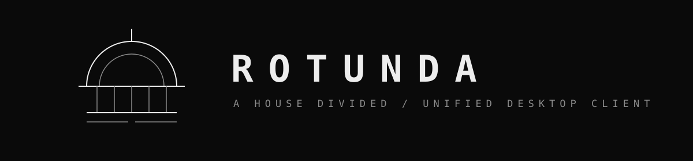
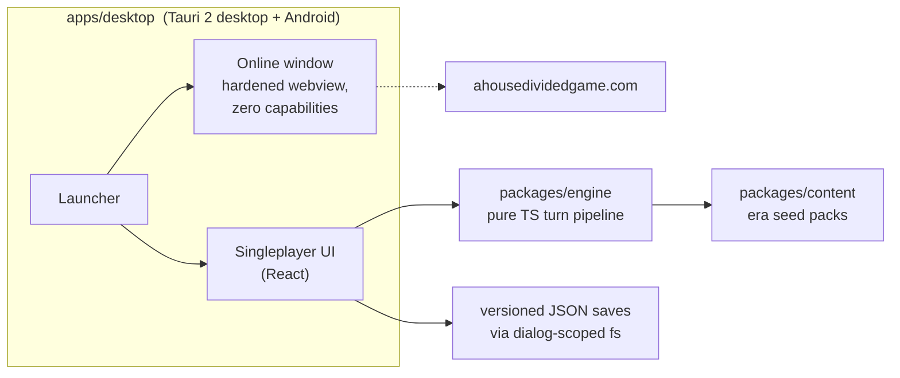

<p align="center">
  
</p>

<p align="center">
  
  
  
  
</p>

**ROTUNDA** is the multiplatform client for [A House Divided](https://www.ahousedividedgame.com): one native app with a live multiplayer entry and a fully local singleplayer sandbox. Desktop builds keep multiplayer in a hardened second webview; Android opens it in the system browser. Boot a local world in any era, as any playable country, advance turns at your own pace, save, and replay a seed.

Singleplayer runs no server. The simulation is a library inside the app process: no listeners, no network, no accounts. Turns cost the player's CPU and nothing else.

## Architecture



| Module | Role |
|---|---|
| `packages/engine` | Deterministic simulation core. No Tauri, no DOM, no IO. Runs headless. |
| `packages/content` | Era seed packs: versioned world templates the engine boots from. |
| `apps/desktop` | Tauri Rust shell plus React webview for desktop and Android. Owns windows, dialogs, file IO, and mode routing. |

Design rules, in order of importance:

1. **One world document.** The entire game state is a single serializable `WorldState`. Saves are versioned JSON envelopes with forward migrations at load.
2. **Determinism.** All randomness flows through a seeded RNG stored in the world. Same seed + same actions = same world, across save/load and across machines. Tests enforce this.
3. **Phases are the porting unit.** Mainline runs ~60 ordered turn phases; each system arrives here as a pure phase over `WorldState`, preserving mainline's relative ordering.
4. **The engine never imports the platform.** Headless forever: tests, balance sims, a future CLI.

The full integration contract, module boundaries, and the binding security doctrine live in [docs/FRAMEWORK.md](docs/FRAMEWORK.md). Active parallel work streams are briefed in [docs/briefs/](docs/briefs/).

## Development

Requires Node >= 22.12 and Rust (plus `libwebkit2gtk-4.1-dev` on Linux).

```
npm install
npm run verify   # typecheck + engine tests: the merge gate
npm run dev      # tauri dev
```

Desktop changes additionally require `npm run build:web --workspace apps/desktop` and `cargo check` in `apps/desktop/src-tauri`.

## Relationship to mainline

Mainline A House Divided is a live multiplayer service. ROTUNDA consumes it in online mode and diverges deliberately in singleplayer: on-demand turns (one turn = one in-game week), local saves, no anti-abuse systems. Both codebases are PolyForm Noncommercial 1.0.0, so simulation logic and seed content move between them freely. Era seed packs are designed to become a shared format: new eras get built and playtested here before mainline resets into them.

## License

[PolyForm Noncommercial 1.0.0](LICENSE.md). Source-available; free for any noncommercial use.
